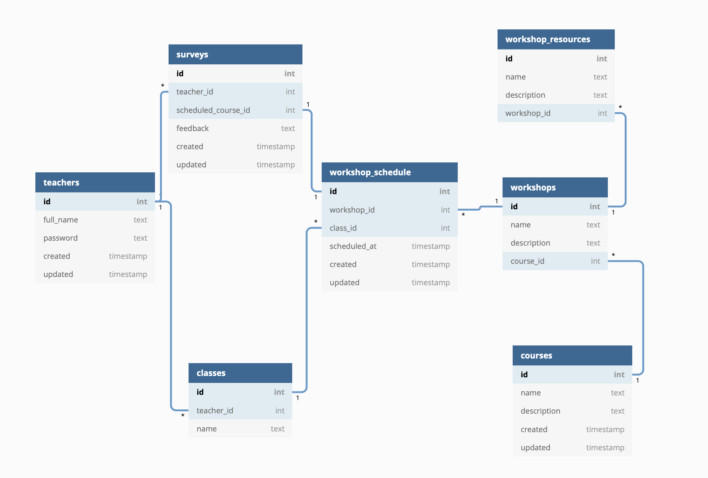

# Teacher Portal

## What I built
Anisa gave me a 4 hour time limit so I hade to decide how to best use the time. Instead of building a small/simple application that was complete, I decided to demonsterate the breadth of what I can build. I think that should give you a better idea of what I would build if I had 9am-5pm every weekday.

### What exists
- Teacher login works
- Upon login, the teacher's information is loaded from the DB using the API
- A mock up of what the dashboard could look like
- A database schema that's appropriate


### What I would do with more time
- Lock down resources. A teacher JWT token should expire, should only grant access to resources that teacher can see, and 
- Implement all the endpoints
- Add filtering to endpoints (for example, it should be easy to sort the schedule or only load events before/after a certain date)
- Design the schema around _all_ the uses of the data, not just the teacher portal.
- Once I've had more time to think about the data model, I would come up with some better names. I'm a big fan of laying everything out on a whiteboard or with a bunch of notecards so you can see the whole picture.
- Don't use the API to serve the HTML. That would be deployed through CloudFront or some other CDN.
- Tune the webpage for appripriate screen sizes (phones? tablets? computers? all three?)


## Technology choices
### API - Golang
It's my backend language of choice for APIs and many scripts. It's fast, compiled, statically typed, and extremely easy to learn. In my experience, new hires can be effective in Go within a few weeks of starting. It's a very opinionated language, so it's easy to follow standard practice, copy code from others, and it has a huge number of packages avaliable.

### Web - HTML/CSS/JS (jQuery)
HTML/CSS/JS... obviously. jQuery is purely what I have experience with for JS. I've been learning react in the last few weeks, but I'm not yet at the level where I wanted to use it to build this demo.

For internal tools, I almost always use bootstrap to lay out the UI.

### DB - PostgreSQL
Can't be beat. It's stable, reliable, and is perfect for both early stage and applications at scale.

For more speed of development, I would consider Google's Firebase Firestore/Database. It can largely remove the need for the API layer for CRUD actions. It's probably not the right choice for scaling up this application though so I decided to stick with postgres.

### Hosting - Heroku
Heroku is a great way to get something deployed quickly and cheaply. For deployment in a production environment, I prefer Elastic Beanstalk on AWS. It's incredibly easy to build an application that scales horizontally, can be deployed to easily, and handles configuration.


## API Endpoints - Implemented
To give a sense of how I build APIs, I included 3 examples:

## Login
Send this your ID (or email?) and password to be granted a token

```
curl -X "POST" "http://localhost:3000/login" \
     -H 'Content-Type: application/json; charset=utf-8' \
     -d $'{
  "id": 135,
  "password": "test"
}'
```


## Get Teacher Data
Get the records for a specific teacher. This currently returns more data than it should to lower the complexity of the web app. Ideally this would return something as simple as 

```
curl "http://localhost:3000/teachers/135" \
     -H 'Authorization: (your token here)'
```


## Get Teacher Data Workshops
Loads the schedule of all workshops for this class.

```
curl "http://localhost:3000/classes/1/schedule" \
     -H 'Authorization: (your token here)'
```


## If you want to build it yourself
You will need to run postgres locally before checking out, building, and running the application. Let me know if you would like instructions for that.

# DB Schema

